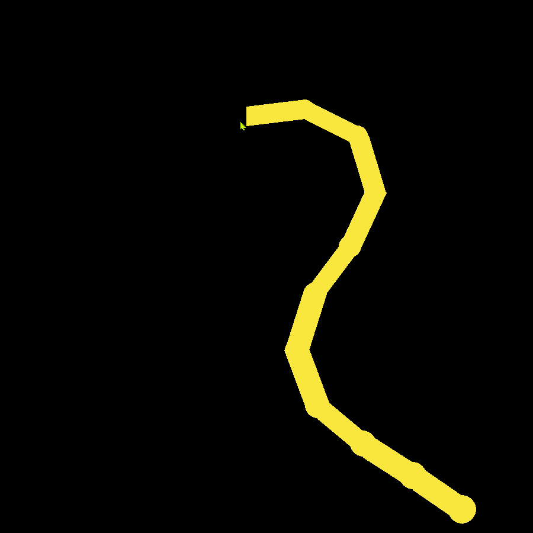

<h1 align="center">Welcome to Tentacle 👋</h1>
Colorfull tentacles using inverse kinematics.

## Usage

```sh
python main.py
```
## Examples

### Monster

### Tentacle

### Snake

### Whip

### Octopus

### Big octopus


