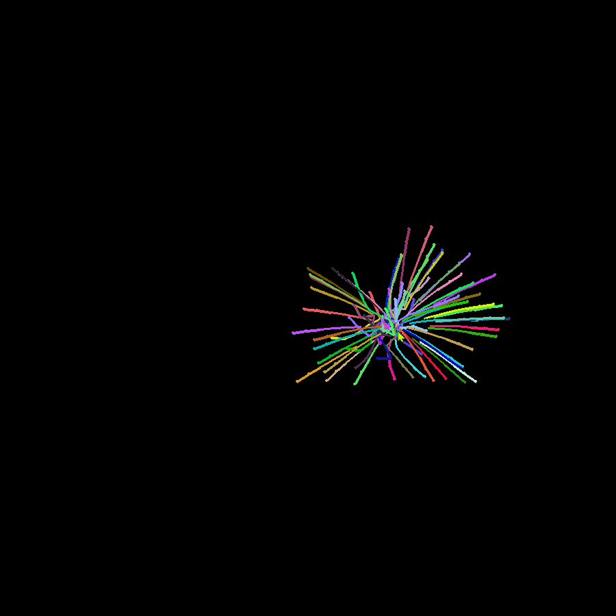
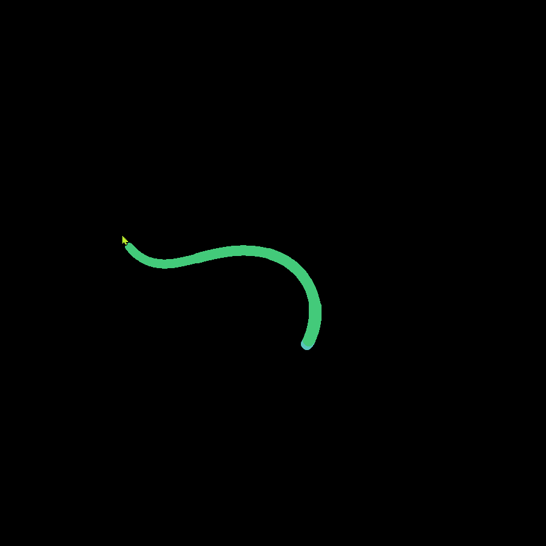
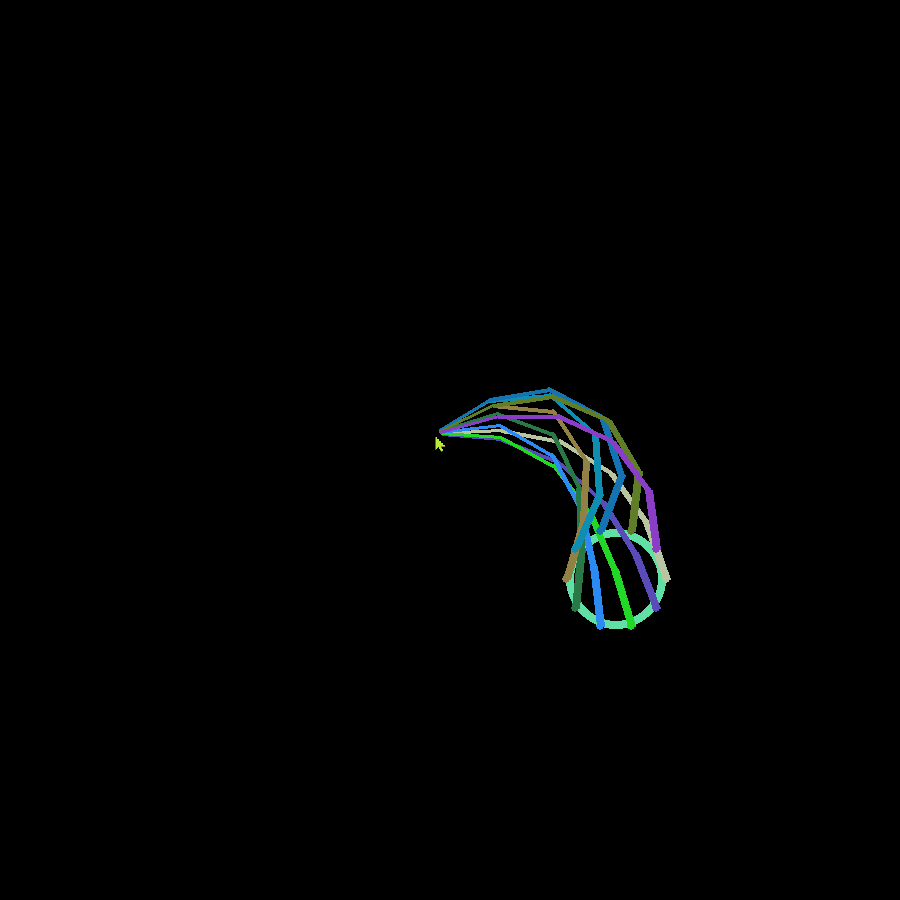
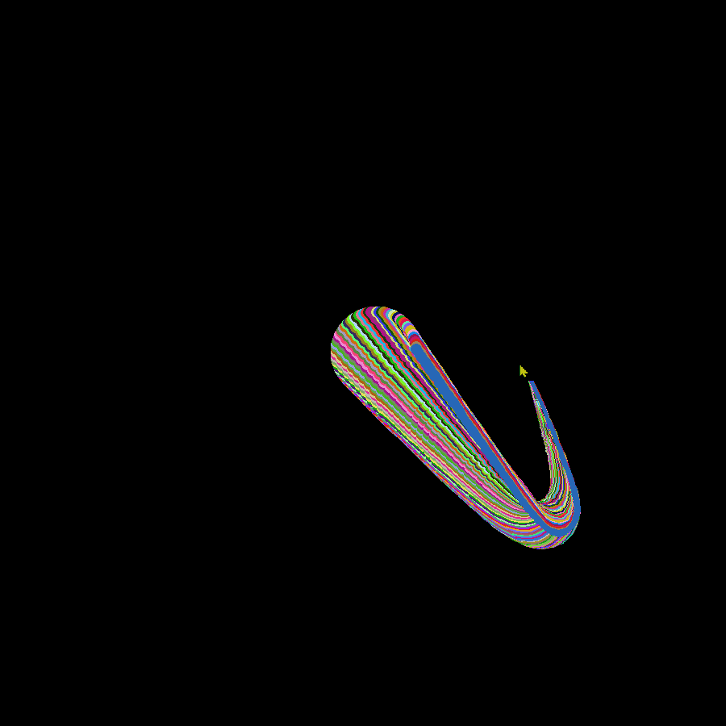
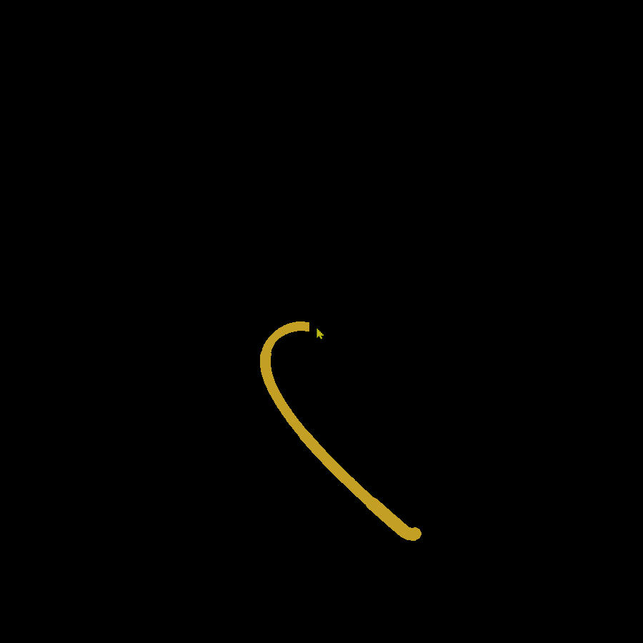

<h1 align="center">Welcome to Tentacle 👋</h1>

Colorfull tentacles using inverse kinematics. You can change length, color, quantity, position etc. You can also move tentacle with WASD controls.







## Usage

```sh
python main.py
```
